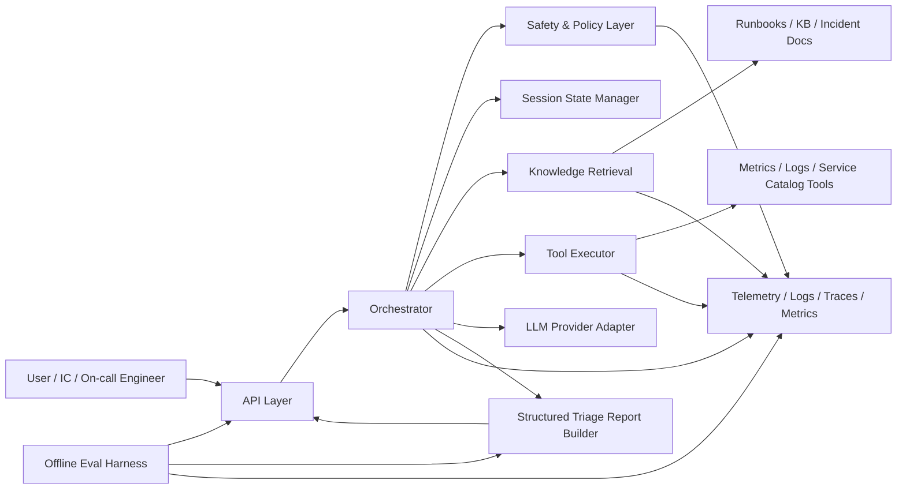

# ARCHITECTURE — AgentOps Triage PoC

## 1. Purpose

This document describes the target architecture of the **AgentOps Triage PoC** and serves as an implementation-oriented handoff artifact for engineering work.

The goal of the system is to accept an incident description, run a bounded agentic triage loop, collect evidence from tools and knowledge sources, apply safety and governance constraints, and return a structured triage report with:
- hypotheses,
- prioritized next steps,
- evidence references,
- safety notes,
- optional approval-required actions.

This is a **read-mostly / safe-by-default PoC**. Destructive or write actions are disabled by default or require explicit approval.

---

## 2. Scope

### In scope
- Incident intake API
- Session-oriented triage execution
- Tool-calling orchestration loop
- Read-only operational tools
- Knowledge retrieval
- Safety gates and policy checks
- Session state and trace persistence
- Metrics, logs, traces
- Offline eval harness

### Out of scope
- Fully autonomous remediation
- Production-grade multi-tenant RBAC
- Direct write access to real infrastructure by default
- Complex long-term memory across organizations
- Full incident management workflow replacement

---

## 3. High-level system goals

The architecture is designed to support the following goals:

1. **Fast first response**  
   Return a useful first structured triage plan within target TTFA.

2. **Evidence-grounded reasoning**  
   Agent outputs must be backed by tool observations and/or KB references.

3. **Bounded autonomy**  
   The system may reason and investigate, but must not execute risky actions without policy approval.

4. **Operational safety**  
   Prevent PII leakage, unsafe tool usage, prompt injection propagation, and unsupported claims.

5. **Observability-first design**  
   Every triage session should be inspectable through logs, traces, tool-call metadata, and evaluation artifacts.

6. **PoC-friendly implementation**  
   Simple enough to build quickly, but structured so it can evolve into a service-oriented platform later.

---

## 4. Primary use case

**Main scenario:**  
An engineer or incident commander submits an incident, for example:

- “High 5xx rate in payments-api”
- “Latency spike after deploy”
- “Customer reports login failures in EU region”

The system should:
1. create a triage session,
2. classify the incident,
3. propose an investigation plan,
4. call relevant tools,
5. gather observations,
6. refine hypotheses,
7. produce a structured triage report,
8. flag actions that require human approval.

---

## 5. Architectural principles

### 5.1 Safe by default
The system defaults to read-only investigation. Any action that may modify state, trigger automation, or affect production requires explicit approval and separate policy handling.

### 5.2 Evidence before conclusion
The agent should prefer:
- observed metrics,
- retrieved runbooks,
- known incidents,
- tool results,
over unsupported free-form speculation.

### 5.3 Small bounded loops
The PoC should limit:
- number of agent iterations,
- number of tool calls,
- time budget per session,
- token budget.

This reduces cost, latency, and unsafe drift.

### 5.4 Clear separation of concerns
The architecture separates:
- API handling,
- orchestration,
- safety,
- tools,
- knowledge retrieval,
- persistence,
- observability,
- evaluation.

### 5.5 Replayability
A session should be reproducible enough for debugging and evals:
- same input,
- same tool traces,
- same policy checks,
- same final report structure.

---

## 6. System context

### Actors
- **On-call engineer / incident commander** — submits incident, reviews output
- **LLM-powered triage agent** — plans and coordinates investigation
- **Operational tools** — monitoring/log/search systems
- **Knowledge base** — runbooks, incident docs, service metadata
- **Policy / safety layer** — constrains and validates outputs
- **Eval harness** — measures quality offline

### External systems (PoC examples)
- Metrics backend
- Logs backend
- Runbook/document store
- Service catalog / CMDB mock
- Incident history store (optional/mock)

---

## 7. Logical architecture



---

## 8. Module Map

```
src/
├── api/                        # HTTP layer (FastAPI)
│   ├── app.py                  # Lifespan, OTEL wiring, router registration
│   ├── routes/
│   │   ├── incident.py         # POST /incident — triage entry point
│   │   ├── sessions.py         # GET /sessions/{id}/trace, PATCH /sessions/{id}/approve
│   │   └── health.py           # GET /health, GET /metrics (Prometheus format)
│   └── serializers.py          # SessionView → HTTP response envelope
│
├── domain/                     # Pure domain types (no I/O)
│   ├── enums.py                # SessionStatus, ToolCallStatus, Severity
│   └── schemas.py              # Pydantic models: IncidentInput, SessionView, FinalReport, …
│
├── orchestrator/               # Core agent loop
│   ├── service.py              # OrchestratorService — plan → retrieve → tool → observe → decide
│   ├── report_builder.py       # ReportBuilder — all report-assembly logic, independently testable
│   ├── budget.py               # SessionBudget — wall-clock + tool-call enforcement
│   ├── context.py              # build_session_context(), RollingSummary
│   └── transitions.py          # can_transition() — state machine guard
│
├── tools/                      # Operational data sources
│   ├── base.py                 # BaseTool, ToolRequest, ToolResult
│   ├── metrics_tool.py         # Live metric profile lookup (per-service profiles)
│   └── logs_tool.py            # Log pattern lookup (per-service log profiles)
│
├── llm/                        # LLM abstraction layer
│   ├── base.py                 # BaseLLMAdapter, LLMAnalysisInput/Output
│   ├── factory.py              # create_llm_adapter() — selects mock vs OpenAI
│   ├── mock_adapter.py         # Deterministic mock for tests/CI
│   ├── openai_adapter.py       # OpenAI Structured Output adapter
│   ├── prompt_builder.py       # build_analysis_prompt() — injects SessionContext
│   └── prompts/                # Versioned prompt templates (planning.txt, analysis.txt, …)
│
├── kb/                         # Knowledge base
│   └── runbooks/               # Per-service runbook markdown files
│
├── safety/                     # Safety pipeline (all pure functions)
│   ├── redaction.py            # PII redaction (EMAIL_RE, PHONE_RE, TOKEN_RE)
│   ├── sanitization.py         # Prompt injection detection + sanitization
│   ├── policy.py               # Next-step policy evaluation → approval gate
│   └── groundedness.py         # Evidence sufficiency check
│
├── persistence/                # Storage abstraction
│   ├── protocols.py            # SessionRepository protocol
│   ├── repository.py           # InMemorySessionRepository (PoC default)
│   └── sqlite_repository.py    # SQLAlchemy/SQLite implementation
│
└── observability/              # Metrics and structured logging
    ├── metrics.py              # MetricsRegistry — counters + latency histograms
    └── logging.py              # Structured JSON logger setup
```

---

## 9. Request Lifecycle

```
POST /incident
    │
    ▼
incident.py (route)
    │  validates IncidentInput via Pydantic
    │  creates session via repository
    │
    ▼
OrchestratorService.run_initial_triage()
    │
    ├── 1. PLAN         validate → planning → InvestigationPlan (signal-aware)
    │
    ├── 2. RETRIEVE     retrieving → RunbookRetrievalTool (kb/runbooks/*.md)
    │
    ├── 3. EXECUTE      executing_tools → MetricsTool + LogsTool
    │      │             (asyncio.wait_for + bounded retry)
    │      └──[any fail]→ tool_failed → analyzing (degraded path continues)
    │
    ├── 4. ANALYZE      build_session_context → build_analysis_prompt → LLM
    │                   (time-budget checked before call)
    │
    └── 5. DECIDE       policy_check → groundedness_check → ReportBuilder
                        → [approval_required] → waiting_approval
                        → [clean]             → completed
                        → [budget/timeout]    → partial_completed
```

---

## 10. Key Design Constraints

| Constraint | Value | Source |
|---|---|---|
| Tool timeout | 3 s per call | `config.py:tool_timeout_s` |
| Tool retries | 2 (transient errors only) | `config.py:max_retries` |
| Session time budget | 30 s wall-clock | `config.py:time_budget_s` |
| Max tool calls | 10 per session | `SessionBudget` |
| Max context observations | 5 | `config.py:max_observations_in_context` |
| PII leakage tolerance | 0 | `docs/EVALS.md §5` |

---

## 11. Related Documents

- [SYSTEM-DESIGN.md](SYSTEM-DESIGN.md) — full design rationale, API contracts, data models
- [STATE_MACHINE.md](STATE_MACHINE.md) — session lifecycle, valid transitions, invariants
- [STATE_MEMORY.md](STATE_MEMORY.md) — context assembly, rolling summary, eviction policy
- [EVALS.md](EVALS.md) — eval fixtures, rubric scorer, PoC success metrics
- [GOVERNANCE.md](GOVERNANCE.md) — policy rules, approval gate triggers, safety pipeline
- [docs/specs/](specs/) — per-module specs (orchestrator, tools, memory-context, serving)
