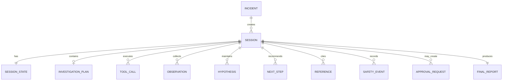

# DATA_MODEL — AgentOps Triage PoC

This document defines the core domain entities of the AgentOps Triage PoC and their relationships.

The purpose of this model is to make the system implementation-ready by clarifying:
- what objects exist in the domain,
- what fields they contain,
- how they relate to each other,
- what should be persisted,
- what is derived or transient.

This is a logical data model, not a final physical database schema.

---

## 1. Modeling principles

### 1.1 Logical-first modeling
This document describes the domain model first.  
The physical implementation may later use:
- Pydantic models,
- dataclasses,
- SQLAlchemy ORM models,
- JSON columns,
- relational tables,
- document storage.

### 1.2 Session-centered design
The main execution unit in the system is a `Session`.

Most important entities are either:
- created inside a session,
- linked to a session,
- or derived from session activity.

### 1.3 Bounded PoC scope
The model is intentionally kept smaller than a full production incident platform.

For example:
- no full user/org/tenant model,
- no advanced RBAC model,
- no full change-management workflow,
- no deep historical graph modeling.

---

## 2. Entity overview

The main entities are:

- `Incident`
- `Session`
- `SessionState`
- `InvestigationPlan`
- `ToolCall`
- `Observation`
- `Hypothesis`
- `NextStep`
- `Reference`
- `SafetyEvent`
- `ApprovalRequest`
- `FinalReport`

---

## 3. High-level relationships

---

## 4. Core entities

### 4.1 Incident

Represents the original incident submitted by the user or external client.

#### Purpose
The `Incident` is the normalized input problem statement that starts triage.

#### Fields

| Field | Type | Required | Description |
|------|------|----------|-------------|
| `incident_id` | UUID | yes | Unique incident identifier |
| `title` | string | yes | Short incident title |
| `service` | string | yes | Main affected service |
| `severity` | string | yes | Severity level, e.g. `P1`, `P2`, `P3`, `P4` |
| `timestamp` | datetime | yes | Reported incident time |
| `summary` | string | yes | Human-readable summary |
| `signals` | array[string] | no | Initial signals or symptoms |
| `environment` | string | no | Environment, e.g. `prod`, `staging` |
| `reporter` | string | no | Who reported the incident |
| `created_at` | datetime | yes | Record creation timestamp |

#### Notes
An `Incident` represents the input event, not the full investigation lifecycle.

---

### 4.2 Session

Represents one triage execution lifecycle.

#### Purpose
A `Session` is the main orchestration context for agent execution.

A single `Incident` may produce one or more sessions in future evolutions, but for the PoC one session is typically created per incident submission.

#### Fields

| Field | Type | Required | Description |
|------|------|----------|-------------|
| `session_id` | UUID | yes | Unique session identifier |
| `incident_id` | UUID | yes | Foreign key to `Incident` |
| `status` | string | yes | Current lifecycle state |
| `iteration_count` | integer | yes | Number of orchestration iterations |
| `llm_provider` | string | no | LLM provider/model used |
| `policy_mode` | string | no | Policy mode, e.g. `strict`, `demo` |
| `started_at` | datetime | yes | Session start time |
| `updated_at` | datetime | yes | Last update time |
| `completed_at` | datetime | no | Completion time if finished |

#### Notes
This is the top-level execution object used for API lookups and trace inspection.

---

### 4.3 SessionState

Represents the current execution status and control metadata of the session.

#### Purpose
Separating `SessionState` from `Session` helps keep lifecycle and orchestration metadata explicit.

#### Fields

| Field | Type | Required | Description |
|------|------|----------|-------------|
| `session_id` | UUID | yes | Foreign key to `Session` |
| `lifecycle_state` | string | yes | e.g. `planning`, `executing_tools`, `completed` |
| `budget_remaining` | integer | no | Remaining budget for steps/tokens/time |
| `last_completed_step` | integer | no | Last fully completed trace step |
| `waiting_for_approval` | boolean | yes | Whether session is blocked for approval |
| `partial_result` | boolean | yes | Whether current result is partial |
| `failure_reason` | string | no | Final or current failure explanation |

#### Notes
In a lightweight implementation, this may be stored together with `Session`, but logically it is useful as a separate object.

---

### 4.4 InvestigationPlan

Represents the current agent plan for investigating the incident.

#### Purpose
The plan captures the structured investigation approach before and during execution.

#### Fields

| Field | Type | Required | Description |
|------|------|----------|-------------|
| `plan_id` | UUID | yes | Unique plan identifier |
| `session_id` | UUID | yes | Foreign key to `Session` |
| `version` | integer | yes | Plan revision number |
| `goal` | string | yes | Investigation goal |
| `steps` | array[string] | yes | Ordered plan steps |
| `status` | string | yes | `draft`, `active`, `superseded`, `completed` |
| `created_at` | datetime | yes | Plan creation time |

#### Notes
The plan may evolve over the session and can be versioned.

---

### 4.5 ToolCall

Represents one invocation of an external or internal tool.

#### Purpose
Tool calls provide live evidence for triage.

#### Fields

| Field | Type | Required | Description |
|------|------|----------|-------------|
| `tool_call_id` | UUID | yes | Unique tool call identifier |
| `session_id` | UUID | yes | Foreign key to `Session` |
| `tool_name` | string | yes | Tool identifier |
| `input_payload` | object | yes | Tool request payload |
| `status` | string | yes | `pending`, `completed`, `failed`, `timed_out` |
| `started_at` | datetime | yes | Start timestamp |
| `completed_at` | datetime | no | Completion timestamp |
| `latency_ms` | integer | no | Measured latency |
| `error_code` | string | no | Failure code if failed |
| `error_message` | string | no | Human-readable failure message |
| `normalized_output` | object | no | Standardized tool result |
| `raw_output_ref` | string | no | Optional pointer to raw stored output |

#### Notes
`normalized_output` is more important than raw tool output, because the orchestrator should consume a consistent schema.

---

### 4.6 Observation

Represents a structured fact collected from tools or retrieval.

#### Purpose
Observations are evidence units used to support hypotheses and recommendations.

#### Fields

| Field | Type | Required | Description |
|------|------|----------|-------------|
| `observation_id` | UUID | yes | Unique observation identifier |
| `session_id` | UUID | yes | Foreign key to `Session` |
| `source_type` | string | yes | `tool`, `kb`, `derived` |
| `source_ref` | string | yes | Link to originating tool/doc/call |
| `title` | string | no | Short label |
| `content` | string | yes | Main evidence content |
| `confidence` | number | no | Confidence score 0..1 |
| `observed_at` | datetime | no | Time of the observed fact |
| `created_at` | datetime | yes | Record creation time |

#### Notes
An observation is not necessarily the same as a raw tool result.  
It is the normalized, useful evidence extracted for reasoning and reporting.

---

### 4.7 Hypothesis

Represents a candidate explanation of the incident.

#### Purpose
The system maintains one or more hypotheses during triage.

#### Fields

| Field | Type | Required | Description |
|------|------|----------|-------------|
| `hypothesis_id` | UUID | yes | Unique hypothesis identifier |
| `session_id` | UUID | yes | Foreign key to `Session` |
| `statement` | string | yes | Human-readable explanation |
| `confidence` | number | yes | Confidence score 0..1 |
| `status` | string | yes | `active`, `weakened`, `discarded`, `confirmed` |
| `supporting_refs` | array[string] | no | References to evidence |
| `created_at` | datetime | yes | Creation timestamp |
| `updated_at` | datetime | yes | Last update time |

#### Notes
Multiple competing hypotheses may coexist during the investigation.

---

### 4.8 NextStep

Represents a recommended next action.

#### Purpose
Next steps communicate what should happen after or during the current triage stage.

#### Fields

| Field | Type | Required | Description |
|------|------|----------|-------------|
| `next_step_id` | UUID | yes | Unique next-step identifier |
| `session_id` | UUID | yes | Foreign key to `Session` |
| `priority` | integer | yes | Lower number = higher priority |
| `action` | string | yes | Recommended step |
| `rationale` | string | no | Why this step matters |
| `requires_approval` | boolean | yes | Whether this step is gated |
| `status` | string | yes | `suggested`, `approved`, `rejected`, `executed`, `skipped` |

#### Notes
For PoC, many next steps are recommendation-only and not automatically executed.

---

### 4.9 Reference

Represents a citation or evidence pointer included in the report.

#### Purpose
References make the output auditable and grounded.

#### Fields

| Field | Type | Required | Description |
|------|------|----------|-------------|
| `reference_id` | string | yes | Stable reference identifier |
| `session_id` | UUID | yes | Foreign key to `Session` |
| `type` | string | yes | `observation`, `kb_doc`, `tool_result` |
| `source` | string | yes | Source system/tool/document store |
| `title` | string | no | Human-readable label |
| `snippet` | string | no | Relevant excerpt |
| `target_ref` | string | no | Pointer to underlying data |

#### Notes
A `Reference` is what the report cites.  
It may point to an `Observation`, tool result, or retrieved KB document.

---

### 4.10 SafetyEvent

Represents a safety, policy, or redaction-related event.

#### Purpose
Safety events help explain blocked actions, redactions, and policy decisions.

#### Fields

| Field | Type | Required | Description |
|------|------|----------|-------------|
| `safety_event_id` | UUID | yes | Unique event identifier |
| `session_id` | UUID | yes | Foreign key to `Session` |
| `type` | string | yes | `policy`, `redaction`, `uncertainty`, `block` |
| `severity` | string | yes | `low`, `medium`, `high` |
| `message` | string | yes | Human-readable explanation |
| `related_ref` | string | no | Related tool call, step, or report item |
| `created_at` | datetime | yes | Creation timestamp |

---

### 4.11 ApprovalRequest

Represents a human approval gate for a risky action.

#### Purpose
Approval requests ensure that the system does not perform risky or write-like actions autonomously.

#### Fields

| Field | Type | Required | Description |
|------|------|----------|-------------|
| `approval_id` | UUID | yes | Unique approval identifier |
| `session_id` | UUID | yes | Foreign key to `Session` |
| `action_type` | string | yes | Type of gated action |
| `reason` | string | yes | Why approval is required |
| `risk_level` | string | yes | `low`, `medium`, `high` |
| `status` | string | yes | `pending`, `approved`, `rejected` |
| `comment` | string | no | Optional reviewer comment |
| `created_at` | datetime | yes | Creation timestamp |
| `resolved_at` | datetime | no | Decision timestamp |

---

### 4.12 FinalReport

Represents the final or latest structured triage output.

#### Purpose
The final report is the main user-facing summary of the session.

#### Fields

| Field | Type | Required | Description |
|------|------|----------|-------------|
| `report_id` | UUID | yes | Unique report identifier |
| `session_id` | UUID | yes | Foreign key to `Session` |
| `status` | string | yes | `completed`, `partial_completed`, `waiting_approval`, `failed` |
| `incident_summary` | object | yes | Compact normalized summary |
| `hypotheses` | array[Hypothesis] | yes | Current hypotheses |
| `next_steps` | array[NextStep] | yes | Recommended next actions |
| `refs` | array[Reference] | yes | Included evidence references |
| `safety_notes` | array[SafetyEvent] | yes | User-visible safety/policy notes |
| `approval_requests` | array[ApprovalRequest] | no | Present if approval is needed |
| `unknowns` | array[string] | no | Known missing evidence or open questions |
| `created_at` | datetime | yes | Report creation timestamp |

---

## 5. Enumerations and recommended values

### 5.1 Severity
Recommended values:
- `P1`
- `P2`
- `P3`
- `P4`

### 5.2 Session lifecycle state
Recommended values:
- `new`
- `validating_input`
- `planning`
- `retrieving`
- `executing_tools`
- `analyzing`
- `waiting_approval`
- `tool_failed`
- `partial_completed`
- `completed`
- `failed`

### 5.3 ToolCall status
Recommended values:
- `pending`
- `completed`
- `failed`
- `timed_out`

### 5.4 Hypothesis status
Recommended values:
- `active`
- `weakened`
- `discarded`
- `confirmed`

### 5.5 NextStep status
Recommended values:
- `suggested`
- `approved`
- `rejected`
- `executed`
- `skipped`

### 5.6 Approval status
Recommended values:
- `pending`
- `approved`
- `rejected`

### 5.7 Safety event type
Recommended values:
- `policy`
- `redaction`
- `uncertainty`
- `block`

---

## 6. Persistence guidance

This section describes what should normally be persisted.

### 6.1 Persist by default
The following should be stored:
- `Incident`
- `Session`
- `SessionState`
- `ToolCall` metadata
- `Observation`
- `Hypothesis`
- `NextStep`
- `Reference`
- `SafetyEvent`
- `ApprovalRequest`
- `FinalReport`

### 6.2 Persist carefully or indirectly
The following may be stored as references rather than inline:
- large raw tool outputs
- sensitive raw payloads
- long retrieval contexts
- full prompt inputs/outputs if policy restricted

### 6.3 Redaction requirement
Sensitive content should be redacted before persistence where necessary.

---

## 7. Derived vs stored objects

### Stored objects
These usually deserve persistence:
- `Incident`
- `Session`
- `SessionState`
- `ToolCall`
- `Observation`
- `Hypothesis`
- `ApprovalRequest`
- `FinalReport`

### Derived/transient objects
These may be computed on the fly in lightweight implementations:
- aggregated confidence summaries
- compact UI-specific report views
- tool-call latency rollups
- ranking views over references

---

## 8. Recommended implementation mapping

This logical model can later map to code in the following way:

### Pydantic / API schemas
Use for:
- request/response payloads
- DTOs
- validation

### ORM models
Use for:
- `Incident`
- `Session`
- `SessionState`
- `ToolCall`
- `Observation`
- `ApprovalRequest`
- `FinalReport`

### Internal domain models
Use for:
- `InvestigationPlan`
- `Hypothesis`
- `NextStep`
- orchestration-specific structures

---

## 9. Example minimal object graph

A minimal successful session may look like this:

- one `Incident`
- one `Session`
- one `SessionState`
- one `InvestigationPlan`
- two `ToolCall`
- three `Observation`
- two `Hypothesis`
- three `NextStep`
- three `Reference`
- one `FinalReport`

A policy-gated session additionally includes:
- one or more `SafetyEvent`
- one `ApprovalRequest`

---

## 10. Open questions

The following design questions may affect the future physical schema:

1. Should one incident support multiple sessions explicitly in the PoC database?
2. Should `FinalReport` be versioned or overwrite latest state?
3. Should `Observation` be immutable once created?
4. Should `Hypothesis` revisions be appended or updated in place?
5. Should raw tool outputs be stored in DB, object storage, or not at all?
6. Should trace events become a separate entity in the next iteration?

---

## 11. Definition of done

The data model is considered implementation-ready when:
- core domain entities are named and defined,
- key fields are explicit,
- relationships are documented,
- enumerations are stable enough for coding,
- persistence expectations are clear,
- backend engineers can map the model into schemas and storage without major ambiguity.