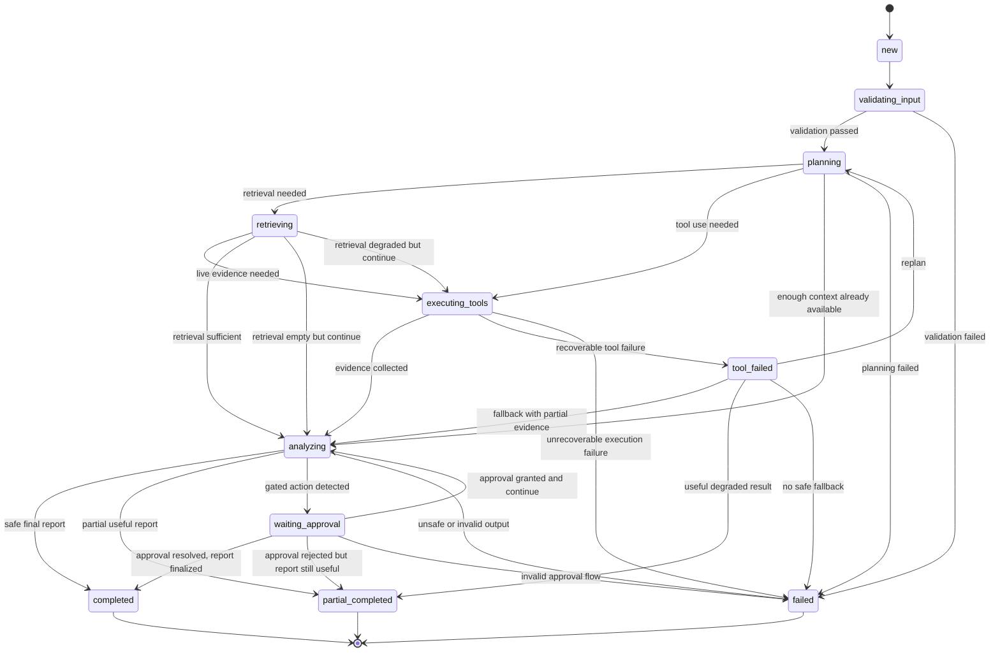

# STATE_MACHINE — AgentOps Triage PoC

This document defines the session lifecycle and state transitions for the AgentOps Triage PoC.

The purpose of this document is to make orchestration behavior implementation-ready by clarifying:
- what states a triage session can be in,
- how the session moves between states,
- what events trigger transitions,
- what terminal and non-terminal states exist,
- what constraints apply to each transition.

This is a logical orchestration model, not a workflow engine implementation.

---

## 1. Purpose

A triage session is not just a static object.  
It evolves over time as the system:
- validates input,
- creates an investigation plan,
- retrieves knowledge,
- executes tools,
- analyzes evidence,
- requests approval when needed,
- returns a final or partial result.

The state machine provides a precise lifecycle model for that process.

Without a state machine, orchestration logic can become inconsistent:
- sessions may skip required checks,
- approval may be accepted in the wrong phase,
- failures may be handled differently across components,
- partial completion may be ambiguous.

---

## 2. Modeling principles

### 2.1 Session-centered lifecycle
The state machine is defined around the `Session` entity.

Each session progresses through a bounded incident triage lifecycle.

### 2.2 One active lifecycle state at a time
At any given moment, a session should have one primary lifecycle state.

Auxiliary flags may still exist, but the lifecycle state remains the main source of truth.

### 2.3 Explicit transitions
A session may only move between states through defined transitions.

This prevents invalid flows such as:
- approving a request when no approval is pending,
- marking a session completed before analysis is done,
- executing tools after a terminal failure without re-entry logic.

### 2.4 Terminal vs non-terminal states
Some states are intermediate and allow further progress.  
Others are terminal and indicate that the session is effectively finished.

### 2.5 Partial completion is a first-class outcome
The system is allowed to produce useful partial results when:
- tools fail,
- time budget is exhausted,
- evidence is incomplete,
- a full conclusion is not safe.

---

## 3. State catalog

The recommended session lifecycle states are:

- `new`
- `validating_input`
- `planning`
- `retrieving`
- `executing_tools`
- `analyzing`
- `waiting_approval`
- `tool_failed`
- `partial_completed`
- `completed`
- `failed`

---

## 4. State definitions

### 4.1 `new`
#### Meaning
The session has been created but processing has not started yet.

#### Entry conditions
- `POST /incident` accepted
- session record created

#### Exit conditions
- input validation begins

#### Terminal
No

---

### 4.2 `validating_input`
#### Meaning
The system is validating and normalizing the incident input.

Typical actions:
- schema validation,
- field normalization,
- text sanitation,
- timestamp normalization,
- redaction if required.

#### Entry conditions
- session created successfully

#### Exit conditions
- validation passed -> move to `planning`
- validation failed irrecoverably -> move to `failed`

#### Terminal
No

---

### 4.3 `planning`
#### Meaning
The system is generating or updating an investigation plan.

Typical actions:
- identify likely investigation strategy,
- choose candidate tools,
- decide whether retrieval is needed,
- define first hypotheses and next steps.

#### Entry conditions
- input validation completed successfully
- or re-entry after another step that requires plan refinement

#### Exit conditions
- knowledge retrieval needed -> move to `retrieving`
- tool execution needed directly -> move to `executing_tools`
- enough information already available -> move to `analyzing`
- planning failure -> move to `failed`

#### Terminal
No

---

### 4.4 `retrieving`
#### Meaning
The system is retrieving relevant runbooks, incident history, or other KB evidence.

Typical actions:
- search runbooks,
- retrieve similar incidents,
- gather service docs,
- rank relevant context.

#### Entry conditions
- plan indicates retrieval is useful

#### Exit conditions
- retrieval succeeded -> move to `executing_tools` or `analyzing`
- retrieval returned nothing useful -> move to `executing_tools` or `analyzing`
- retrieval backend failure -> continue with fallback path, usually `executing_tools` or `analyzing`

#### Terminal
No

---

### 4.5 `executing_tools`
#### Meaning
The system is calling operational tools to gather live evidence.

Typical actions:
- fetch metrics,
- fetch logs,
- fetch deployment metadata,
- fetch service catalog information.

#### Entry conditions
- planning or retrieval determined that tool calls are needed

#### Exit conditions
- tools succeeded sufficiently -> move to `analyzing`
- one or more tools failed but fallback is possible -> move to `tool_failed`
- unrecoverable execution failure -> move to `failed`

#### Terminal
No

---

### 4.6 `analyzing`
#### Meaning
The system is synthesizing observations into hypotheses, next steps, and a structured report.

Typical actions:
- compare evidence,
- refine hypotheses,
- rank next steps,
- attach references,
- run safety and grounding checks,
- determine whether approval is needed.

#### Entry conditions
- enough evidence or partial evidence is available
- planning/retrieval/tool execution produced usable material

#### Exit conditions
- safe report produced -> move to `completed`
- partial but useful report produced -> move to `partial_completed`
- action requires human decision -> move to `waiting_approval`
- unsafe or invalid output that cannot be repaired -> move to `failed`

#### Terminal
No

---

### 4.7 `waiting_approval`
#### Meaning
The session is blocked pending a human decision on a gated action.

Typical cases:
- rollback recommendation,
- restart recommendation,
- any future write-capable remediation.

#### Entry conditions
- analysis identifies a risky or policy-gated action
- an `ApprovalRequest` is created

#### Exit conditions
- approval granted -> move to `analyzing` or `completed` depending on implementation
- approval rejected -> move to `completed` or `partial_completed`
- approval request invalidated -> move to `failed` in exceptional cases

#### Terminal
No

---

### 4.8 `tool_failed`
#### Meaning
One or more tool calls failed, but the session may still continue.

This is a recoverable degradation state, not an automatic terminal state.

#### Entry conditions
- a tool timeout occurred
- dependency unavailable
- normalization/parsing failed
- at least some fallback path remains possible

#### Exit conditions
- fallback path continues -> move to `analyzing`
- replanning required -> move to `planning`
- accumulated degradation too high -> move to `partial_completed` or `failed`

#### Terminal
No

---

### 4.9 `partial_completed`
#### Meaning
The session returned a useful but incomplete result.

Typical reasons:
- missing evidence,
- one or more tool failures,
- budget/time exhaustion,
- unresolved ambiguity.

#### Entry conditions
- the system can provide useful output but not a fully supported conclusion

#### Exit conditions
- none in the PoC default flow

#### Terminal
Yes

---

### 4.10 `completed`
#### Meaning
The session finished successfully and returned a structured triage report.

#### Entry conditions
- enough evidence collected
- report passed safety checks
- no pending approval remains

#### Exit conditions
- none

#### Terminal
Yes

---

### 4.11 `failed`
#### Meaning
The session could not produce a safe or usable result.

Typical reasons:
- invalid input,
- unrecoverable orchestration failure,
- policy block with no safe fallback,
- persistence failure,
- repeated dependency failure with no meaningful degraded output.

#### Entry conditions
- unrecoverable failure detected

#### Exit conditions
- none in default PoC flow

#### Terminal
Yes

---

## 5. State diagram

---

## 6. Transition catalog

This section defines the main transitions explicitly.

| From | To | Trigger | Notes |
|------|----|---------|-------|
| `new` | `validating_input` | session created | Start processing |
| `validating_input` | `planning` | input valid | Normal path |
| `validating_input` | `failed` | input invalid | Validation failure |
| `planning` | `retrieving` | KB lookup required | Runbook/history retrieval |
| `planning` | `executing_tools` | live evidence required | Metrics/logs/etc |
| `planning` | `analyzing` | enough context already available | Rare fast path |
| `planning` | `failed` | planning error | LLM/orchestrator failure |
| `retrieving` | `executing_tools` | additional live evidence needed | Common path |
| `retrieving` | `analyzing` | retrieval sufficient | KB-first case |
| `executing_tools` | `analyzing` | evidence gathered | Normal path |
| `executing_tools` | `tool_failed` | recoverable tool failure | Degraded flow |
| `executing_tools` | `failed` | unrecoverable failure | Hard stop |
| `tool_failed` | `analyzing` | fallback possible | Proceed with partial evidence |
| `tool_failed` | `planning` | replan needed | Alternative strategy |
| `tool_failed` | `partial_completed` | useful incomplete result | Graceful degradation |
| `tool_failed` | `failed` | no fallback | Terminal failure |
| `analyzing` | `completed` | safe final report ready | Success |
| `analyzing` | `partial_completed` | only partial report safe/useful | Graceful completion |
| `analyzing` | `waiting_approval` | gated action detected | Human-in-the-loop |
| `analyzing` | `failed` | report unusable or unsafe | Terminal failure |
| `waiting_approval` | `analyzing` | approval granted and workflow resumes | Optional resume path |
| `waiting_approval` | `completed` | approval resolved and final report ready | Simplified path |
| `waiting_approval` | `partial_completed` | approval rejected but safe report still possible | Degraded resolution |
| `waiting_approval` | `failed` | invalid approval handling | Exceptional path |

---

## 7. Terminal states

The following states are terminal in the default PoC lifecycle:
- `completed`
- `partial_completed`
- `failed`

A terminal state means the current session lifecycle is finished and should not continue normal orchestration.

---

## 8. Approval semantics

### 8.1 Why approval is a state
Approval is modeled as a dedicated lifecycle state because it creates a real pause in automation.

The system must not:
- silently continue,
- assume approval,
- perform risky actions before explicit decision.

### 8.2 Approval outcomes
Possible outcomes:
- approved -> continue or finalize
- rejected -> finalize with safe alternative or partial report
- invalid -> fail if state integrity is broken

### 8.3 State integrity rule
`POST /sessions/{session_id}/approval` is only valid when session state is `waiting_approval`.

---

## 9. Failure and degradation semantics

### 9.1 Recoverable degradation
Not every tool failure should terminate the session.

Examples:
- metrics unavailable but logs available
- deployment metadata missing but runbook available
- incident history empty but current evidence sufficient

These cases should prefer:
- `tool_failed`
- then `analyzing`
- or `partial_completed`

### 9.2 Hard failure
The system should move to `failed` when:
- input is invalid,
- state becomes inconsistent,
- safety checks block output with no safe alternative,
- orchestration breaks irrecoverably,
- persistence/reporting fails in a way that prevents trustworthy output.

### 9.3 Partial completion
`partial_completed` is preferable to `failed` when the user can still receive:
- a useful hypothesis,
- a useful set of next steps,
- explicit uncertainty,
- known gaps.

---

## 10. Entry and exit actions

This section describes recommended actions performed on entering or leaving states.

### 10.1 On entering `validating_input`
- validate schema
- normalize fields
- sanitize text
- create initial validation log entry

### 10.2 On entering `planning`
- initialize or update investigation plan
- decide candidate tools
- decide whether retrieval is needed

### 10.3 On entering `retrieving`
- run retrieval tool(s)
- normalize documents/snippets
- attach retrieval references

### 10.4 On entering `executing_tools`
- invoke selected tools
- record tool calls
- capture tool latencies and statuses

### 10.5 On entering `tool_failed`
- persist failure metadata
- determine fallback options
- emit degraded execution event

### 10.6 On entering `analyzing`
- synthesize evidence
- update hypotheses
- rank next steps
- perform grounding checks
- perform safety checks

### 10.7 On entering `waiting_approval`
- create `ApprovalRequest`
- persist pending approval
- emit policy/safety event

### 10.8 On entering `completed`
- persist final report
- finalize trace
- emit completion metrics

### 10.9 On entering `partial_completed`
- persist degraded final report
- attach uncertainty and missing evidence notes
- emit degradation metrics

### 10.10 On entering `failed`
- persist failure reason
- finalize trace with failure state
- emit failure metrics

---

## 11. Invariants

The following invariants should hold throughout the session lifecycle.

### 11.1 Single primary lifecycle state
A session has exactly one current lifecycle state.

### 11.2 Approval consistency
If state is `waiting_approval`, there must be at least one pending `ApprovalRequest`.

### 11.3 Terminal state stability
If a session is in `completed`, `partial_completed`, or `failed`, normal orchestration must stop.

### 11.4 Report consistency
If a session is in `completed` or `partial_completed`, a `FinalReport` must exist.

### 11.5 Safety before completion
A session must not enter `completed` before the final report passes required safety/policy checks.

---

## 12. Suggested implementation notes

This state machine can be implemented in several ways:
- explicit enum + transition validation in service code,
- lightweight workflow manager,
- reducer-style state transitions,
- domain service methods with guard checks.

For the PoC, a lightweight explicit transition validator is usually sufficient.

Recommended implementation elements:
- `SessionLifecycleState` enum
- transition validation function
- orchestration service that emits state changes
- audit log / trace events per transition

---

## 13. Example happy path

A common successful flow may look like this:

1. `new`
2. `validating_input`
3. `planning`
4. `retrieving`
5. `executing_tools`
6. `analyzing`
7. `completed`

Example interpretation:
- incident arrives,
- input validated,
- plan created,
- runbook retrieved,
- metrics and logs fetched,
- evidence analyzed,
- final triage report returned.

---

## 14. Example degraded path

A common degraded flow may look like this:

1. `new`
2. `validating_input`
3. `planning`
4. `executing_tools`
5. `tool_failed`
6. `analyzing`
7. `partial_completed`

Example interpretation:
- incident arrives,
- validation succeeds,
- metrics tool times out,
- logs still available,
- system returns a useful but incomplete report.

---

## 15. Example approval path

A common approval flow may look like this:

1. `new`
2. `validating_input`
3. `planning`
4. `retrieving`
5. `executing_tools`
6. `analyzing`
7. `waiting_approval`
8. `completed`

Example interpretation:
- incident investigated,
- system identifies rollback as a gated recommendation,
- approval is requested,
- human decision resolves the flow,
- final report is completed.

---

## 16. Open questions

1. Should `retrieving` and `executing_tools` be merged in a minimal implementation?
2. Should approval resumption always return to `analyzing`, or may some cases finalize directly?
3. Should repeated tool failures remain in `tool_failed`, or should that state be transient only?
4. Should asynchronous execution introduce additional states such as `queued` or `cancelled`?
5. Should trace events become a first-class parallel lifecycle object in the next iteration?

---

## 17. Definition of done

The session lifecycle model is considered implementation-ready when:
- all major session states are defined,
- valid transitions are explicit,
- terminal states are clear,
- approval behavior is modeled,
- degraded and failed outcomes are distinguished,
- developers can implement orchestration logic without major lifecycle ambiguity.