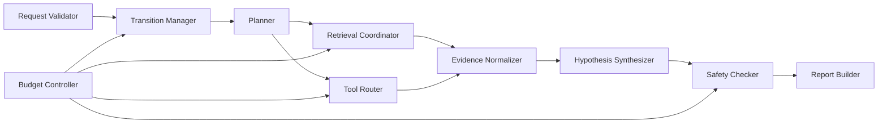

# C4 Component — Orchestrator

```mermaid
flowchart LR
    RV[Request Validator] --> TM[Transition Manager]
    TM --> PL[Planner]
    PL --> RC[Retrieval Coordinator]
    PL --> TR[Tool Router]

    RC --> EN[Evidence Normalizer]
    TR --> EN

    EN --> HS[Hypothesis Synthesizer]
    HS --> SC[Safety Checker]
    SC --> RB[Report Builder]

    BC[Budget Controller] --> TM
    BC --> RC
    BC --> TR
    BC --> SC
```
