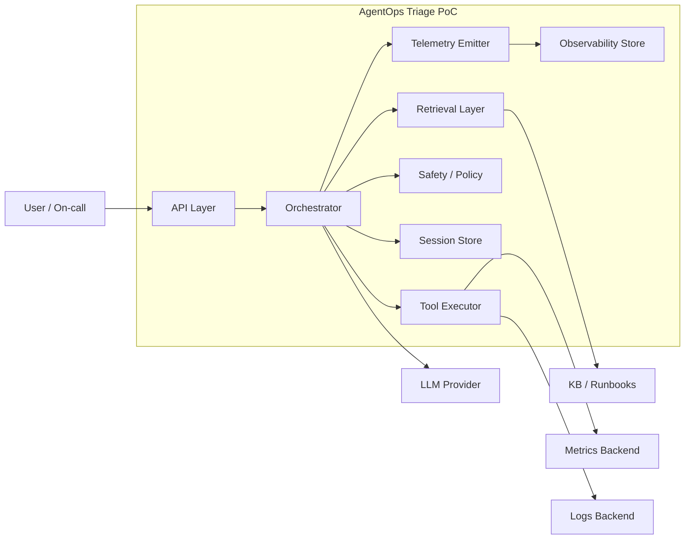

# C4 Container

```mermaid
flowchart LR
    U[User / On-call]

    subgraph SYS[AgentOps Triage PoC]
        API[API Layer]
        ORCH[Orchestrator]
        RETR[Retrieval Layer]
        TOOLS[Tool Executor]
        SAFE[Safety / Policy]
        STORE[Session Store]
        TELE[Telemetry Emitter]
        OSTORE[Observability Store]
    end

    KB[KB / Runbooks]
    MET[Metrics Backend]
    LOG[Logs Backend]
    LLM[LLM Provider]

    U --> API
    API --> ORCH
    ORCH --> RETR
    ORCH --> TOOLS
    ORCH --> SAFE
    ORCH --> STORE
    ORCH --> TELE

    RETR --> KB
    TOOLS --> MET
    TOOLS --> LOG
    ORCH --> LLM

    TELE --> OSTORE
```
