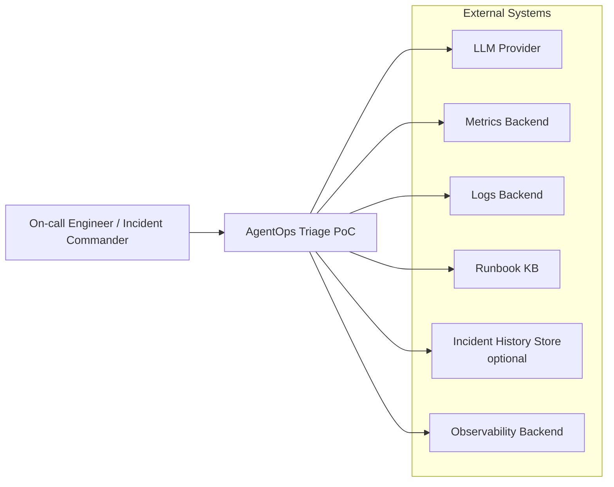

# C4 Context

```mermaid
flowchart LR
    U[On-call Engineer / Incident Commander]
    SYS[AgentOps Triage PoC]

    subgraph EXT[External Systems]
        LLM[LLM Provider]
        MET[Metrics Backend]
        LOG[Logs Backend]
        KB[Runbook KB]
        HIST[Incident History Store<br/>optional]
        OBS[Observability Backend]
    end

    U --> SYS
    SYS --> LLM
    SYS --> MET
    SYS --> LOG
    SYS --> KB
    SYS --> HIST
    SYS --> OBS
```

