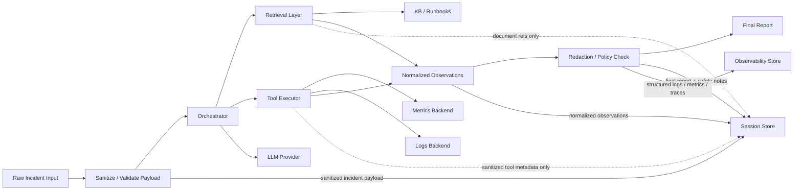

# Data Flow

```mermaid
flowchart LR
    RI[Raw Incident Input]
    SP[Sanitize / Validate Payload]
    ORCH[Orchestrator]
    RETR[Retrieval Layer]
    TOOLS[Tool Executor]
    LLM[LLM Provider]
    OBSV[Normalized Observations]
    SAFE[Redaction / Policy Check]
    REP[Final Report]

    SSTORE[Session Store]
    OSTORE[Observability Store]

    KB[KB / Runbooks]
    MET[Metrics Backend]
    LOG[Logs Backend]

    RI --> SP
    SP --> ORCH

    ORCH --> RETR
    ORCH --> TOOLS
    ORCH --> LLM

    RETR --> KB
    TOOLS --> MET
    TOOLS --> LOG

    RETR --> OBSV
    TOOLS --> OBSV

    OBSV --> SAFE
    SAFE --> REP

    SP -->|sanitized incident payload| SSTORE
    OBSV -->|normalized observations| SSTORE
    SAFE -->|final report + safety notes| SSTORE

    RETR -.->|document refs only| SSTORE
    TOOLS -.->|sanitized tool metadata only| SSTORE

    SAFE -->|structured logs / metrics / traces| OSTORE
```

