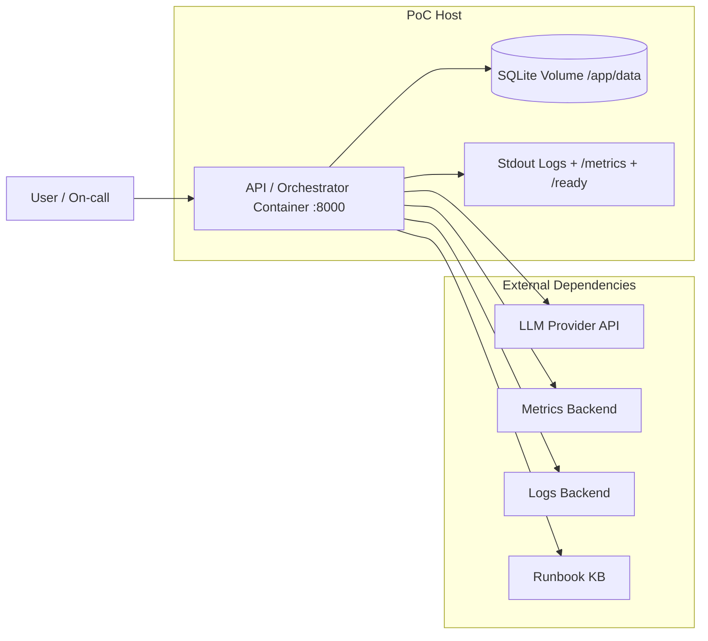

# Deployment — PoC Topology

## Minimal container packaging

The current PoC packaging assumes:
- one application container built from the repo `Dockerfile`;
- one persistent Docker volume for SQLite state;
- bridge-network access from the app container to external APIs;
- environment-based configuration through `.env` and `docker-compose.yml`.

Resource limits are intentionally lightweight for the PoC:
- CPU and memory limits are not hard-pinned in Compose by default;
- bounded runtime behavior is enforced primarily by app-level limits:
  - `max_tool_calls`
  - `tool_timeout_s`
  - `time_budget_s`

If stricter infra constraints are needed later, Docker Compose can be extended with:
- `mem_limit`
- `cpus`
- explicit healthcheck
- separate observability sink
