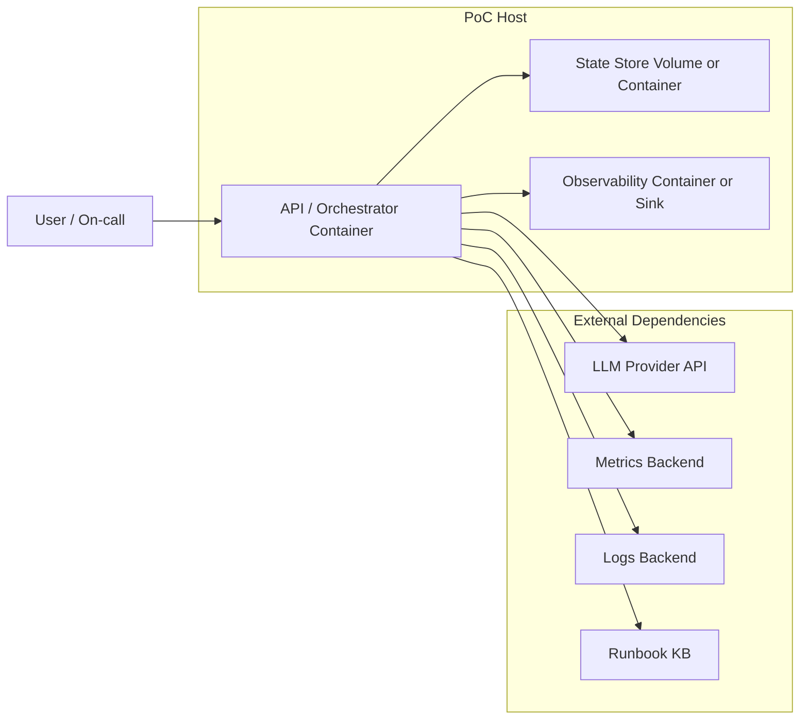

# Deployment — PoC Topology

```mermaid
flowchart LR
    U[User / On-call]

    subgraph HOST[PoC Host]
        API[API / Orchestrator Container]
        STORE[State Store Volume or Container]
        OBS[Observability Container or Sink]
    end

    subgraph EXT[External Dependencies]
        LLM[LLM Provider API]
        MET[Metrics Backend]
        LOG[Logs Backend]
        KB[Runbook KB]
    end

    U --> API
    API --> STORE
    API --> OBS

    API --> LLM
    API --> MET
    API --> LOG
    API --> KB
```