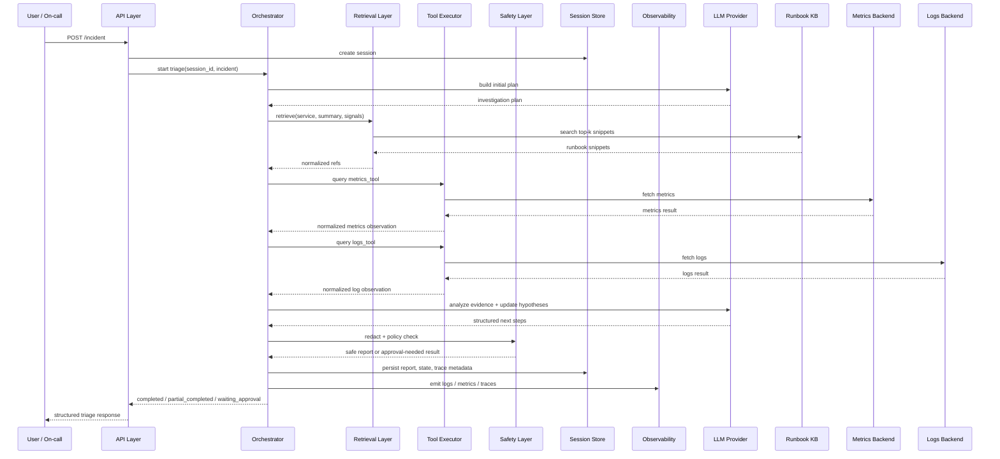

# Sequence — Triage Request

```mermaid
sequenceDiagram
    participant U as User / On-call
    participant API as API Layer
    participant ORCH as Orchestrator
    participant RETR as Retrieval Layer
    participant TOOLS as Tool Executor
    participant SAFE as Safety Layer
    participant STORE as Session Store
    participant OBS as Observability
    participant LLM as LLM Provider
    participant KB as Runbook KB
    participant MET as Metrics Backend
    participant LOG as Logs Backend

    U->>API: POST /incident
    API->>STORE: create session
    API->>ORCH: start triage(session_id, incident)

    ORCH->>LLM: build initial plan
    LLM-->>ORCH: investigation plan

    ORCH->>RETR: retrieve(service, summary, signals)
    RETR->>KB: search top-k snippets
    KB-->>RETR: runbook snippets
    RETR-->>ORCH: normalized refs

    ORCH->>TOOLS: query metrics_tool
    TOOLS->>MET: fetch metrics
    MET-->>TOOLS: metrics result
    TOOLS-->>ORCH: normalized metrics observation

    ORCH->>TOOLS: query logs_tool
    TOOLS->>LOG: fetch logs
    LOG-->>TOOLS: logs result
    TOOLS-->>ORCH: normalized log observation

    ORCH->>LLM: analyze evidence + update hypotheses
    LLM-->>ORCH: structured next steps

    ORCH->>SAFE: redact + policy check
    SAFE-->>ORCH: safe report or approval-needed result

    ORCH->>STORE: persist report, state, trace metadata
    ORCH->>OBS: emit logs / metrics / traces
    ORCH-->>API: completed / partial_completed / waiting_approval
    API-->>U: structured triage response
```
