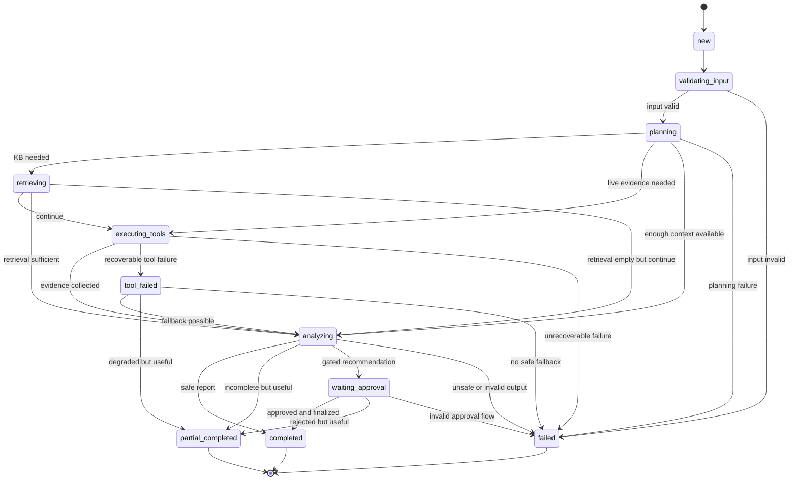

# State Machine — Session Lifecycle

```mermaid
stateDiagram-v2
    [*] --> new
    new --> validating_input

    validating_input --> planning : input valid
    validating_input --> failed : input invalid

    planning --> retrieving : KB needed
    planning --> executing_tools : live evidence needed
    planning --> analyzing : enough context available
    planning --> failed : planning failure

    retrieving --> executing_tools : continue
    retrieving --> analyzing : retrieval sufficient
    retrieving --> analyzing : retrieval empty but continue

    executing_tools --> analyzing : evidence collected
    executing_tools --> tool_failed : recoverable tool failure
    executing_tools --> failed : unrecoverable failure

    tool_failed --> analyzing : fallback possible
    tool_failed --> partial_completed : degraded but useful
    tool_failed --> failed : no safe fallback

    analyzing --> completed : safe report
    analyzing --> partial_completed : incomplete but useful
    analyzing --> waiting_approval : gated recommendation
    analyzing --> failed : unsafe or invalid output

    waiting_approval --> completed : approved and finalized
    waiting_approval --> partial_completed : rejected but useful
    waiting_approval --> failed : invalid approval flow

    completed --> [*]
    partial_completed --> [*]
    failed --> [*]
```
   