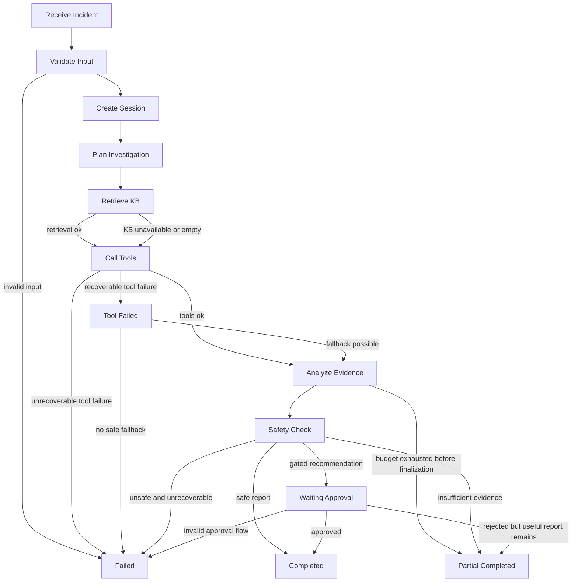

# Workflow

```mermaid
flowchart TD
    A[Receive Incident] --> B[Validate Input]
    B -->|invalid input| X[Failed]

    B --> C[Create Session]
    C --> D[Plan Investigation]
    D --> E[Retrieve KB]

    E -->|retrieval ok| F[Call Tools]
    E -->|KB unavailable or empty| F

    F -->|tools ok| G[Analyze Evidence]
    F -->|recoverable tool failure| TF[Tool Failed]
    F -->|unrecoverable tool failure| X

    TF -->|fallback possible| G
    TF -->|no safe fallback| X

    G --> H[Safety Check]
    G -->|budget exhausted before finalization| P[Partial Completed]

    H -->|safe report| Z[Completed]
    H -->|gated recommendation| W[Waiting Approval]
    H -->|unsafe and unrecoverable| X
    H -->|insufficient evidence| P

    W -->|approved| Z
    W -->|rejected but useful report remains| P
    W -->|invalid approval flow| X
```
